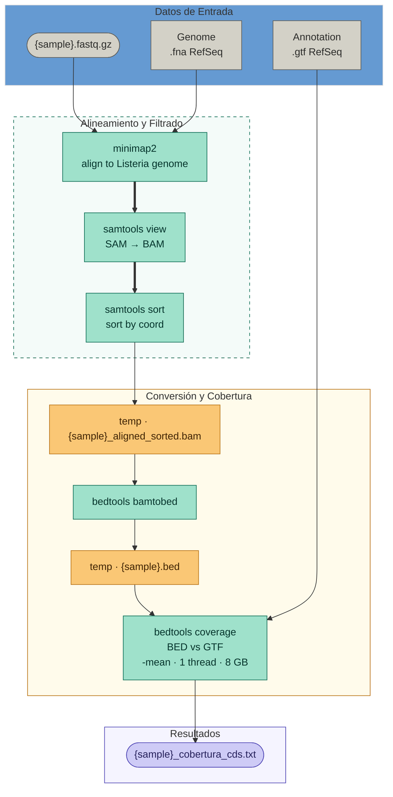

Pipeline para buscar genes de listeria en muestras

```mermaid
flowchart TB
    %% --- ENTRADAS ---
    subgraph INPUTS ["Datos de Entrada"]
        INPUT(["{sample}.fastq.gz"])
        GENOME["Genome\n.fna RefSeq"]
        GTF["Annotation\n.gtf RefSeq"]
    end

    %% --- PROCESAMIENTO EN STREAMING ---
    subgraph ALIGNMENT ["Alineamiento y Filtrado"]
        MM["minimap2\nalign to Listeria genome"]
        SV["samtools view\nSAM → BAM"]
        SS["samtools sort\nsort by coord"]
        
        MM ==>  SV ==>  SS
    end

    %% --- PASOS INTERMEDIOS Y ANÁLISIS ---
    subgraph ANALYSIS ["Conversión y Cobertura"]
        SBAM["temp · {sample}_aligned_sorted.bam"]
        B2B["bedtools bamtobed"]
        BED["temp · {sample}.bed"]
        COV["bedtools coverage\nBED vs GTF\n-mean · 1 thread · 8 GB"]
    end

    %% --- SALIDA ---
    subgraph OUTPUTS ["Resultados"]
        OUTPUT(["{sample}_cobertura_cds.txt"])
    end

    %% --- CONEXIONES GLOBALES ---
    INPUT & GENOME --> MM
    SS --> SBAM
    SBAM --> B2B
    B2B --> BED
    BED & GTF --> COV
    COV --> OUTPUT

    %% --- ESTILOS ---
    style INPUT  fill:#D3D1C7,stroke:#5F5E5A,color:#2C2C2A
    style GENOME fill:#D3D1C7,stroke:#5F5E5A,color:#2C2C2A
    style GTF    fill:#D3D1C7,stroke:#5F5E5A,color:#2C2C2A
    
    style MM     fill:#9FE1CB,stroke:#0F6E56,color:#04342C
    style SV     fill:#9FE1CB,stroke:#0F6E56,color:#04342C
    style SS     fill:#9FE1CB,stroke:#0F6E56,color:#04342C
    style B2B    fill:#9FE1CB,stroke:#0F6E56,color:#04342C
    style COV    fill:#9FE1CB,stroke:#0F6E56,color:#04342C

    style SBAM   fill:#FAC775,stroke:#BA7517,color:#412402
    style BED    fill:#FAC775,stroke:#BA7517,color:#412402
    
    style OUTPUT fill:#CECBF6,stroke:#534AB7,color:#26215C

    %% Estilos de los subgrafos para dar estructura limpia
    style INPUTS fill:#659ad2,stroke:#ddd,stroke-width:1px
    style ALIGNMENT fill:#f4fbf9,stroke:#0F6E56,stroke-width:1px,stroke-dasharray: 5 5
    style ANALYSIS fill:#fffbeb,stroke:#BA7517,stroke-width:1px
    style OUTPUTS fill:#f5f4ff,stroke:#534AB7,stroke-width:1px
```

