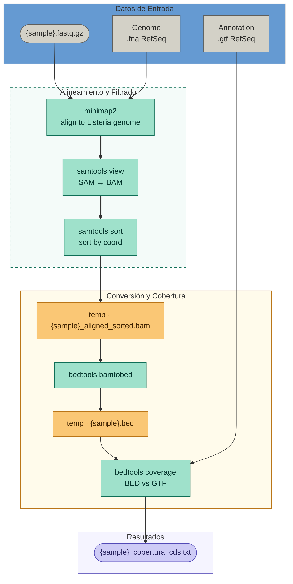

Pipeline para buscar genes de listeria en muestras

## Explicacion del pipeline
### Se alinean todas las lecturas de las muestras al genoma de Listeria monocytogenes, utilizando minimap2. Se pasan los archivos .sam obtenidos a .bam y se los ordena con sort. El bam es transformado a bed por comodidad y se calcula el coverage de genes con bedtools. 

## Genes de interes
### Se generó un script de python para parsear los archivos y filtrar genes de interes de Lm.

|Genes de interes | Nombre|
|-----|------|
|prfA | Positive Regulatory Factor A|
|hly  | Listeriolisina O (LLO)|
|actA | Proteína de polimerización de actina|
|plcA | Fosfolipasa A|
|plcB | Fosfolipasa B|
|inlA |Internalina A |
|inlB |Internalina B |
|inlC |Internalina C|
|inlJ |Internalina J|
|lmo0733 |Internalin-like protein|
|lmo0113 |Permeasa PTS específica de beta-glucósido|
|lmo2122 |Componente de permeasa PTS específico de L. monocytogenes|
|prs  |Fosforribosilpirofosfato sintetasa|

## Resultados

### UC

|Muestra|	Gene	|Locus_Tag	|Cobertura	|Categoria_Marcador|
|-------|-----------|-----------|-----------|------------------|
|UC02-IgG-neg_S64	|prs	|lmo0199	|0.041929	|Fosforribosilpirofosfato sintetasa|
|UC05-IgG-neg_S70	|prs	|lmo0199	|0.126834	|Fosforribosilpirofosfato sintetasa|
|UC13-IgG-neg_S86	|lmo0733	|lmo0733	|0.072978	|Internalin-like protein|

### CD

|Muestra|	Gene|	Locus_Tag|	Cobertura|	Categoria_Marcador|
|-------|-------|------------|-----------|--------------------|
|53_S3	|prs	|lmo0199	|0.083857|	Fosforribosilpirofosfato sintetasa|
|60_S10	|prs	|lmo0199	|0.041929	|Fosforribosilpirofosfato sintetasa|
|67_S17	|lmo0733|lmo0733	|0.994083|	Internalin-like protein|
|74_S24	|prs	|lmo0199	|0.041929	|Fosforribosilpirofosfato sintetasa|
|76_S26	|prs	|lmo0199	|0.083857	|Fosforribosilpirofosfato sintetasa|
|77_S27	|prs	|lmo0199	|0.083857	|Fosforribosilpirofosfato sintetasa|
|78_S28	|prs	|lmo0199	|0.457023	|Fosforribosilpirofosfato sintetasa|
|79_S29	|prs	|lmo0199	|0.041929	|Fosforribosilpirofosfato sintetasa|
80_S30	|prs	|lmo0199	|0.041929	|Fosforribosilpirofosfato sintetasa|
|CD13-IgG-neg_S29_L001	|prs	|lmo0199	|0.120545|	Fosforribosilpirofosfato sintetasa|
|CD13-IgG-neg_S29_L002	|prs	|lmo0199	|0.227463|	Fosforribosilpirofosfato sintetasa|
|CD13-IgG-neg_S29_L003	|prs	|lmo0199	|0.031447|	Fosforribosilpirofosfato sintetasa|
|CD13-IgG-neg_S29_L004	|prs	|lmo0199	|0.115304|	Fosforribosilpirofosfato sintetasa|

## Genes totales
[CD_RESULTS](https://github.com//laugior/search4listeria/tree/main/resultados/CD_ALL_COV/reporte_cobertura_CD.tsv)
[UC_RESULTS](https://github.com//laugior/search4listeria/tree/main/resultados/UC_ALL_COV/reporte_cobertura_UC.tsv)
